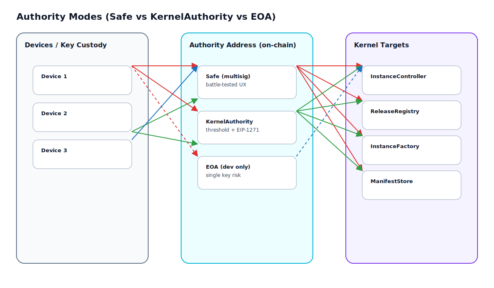
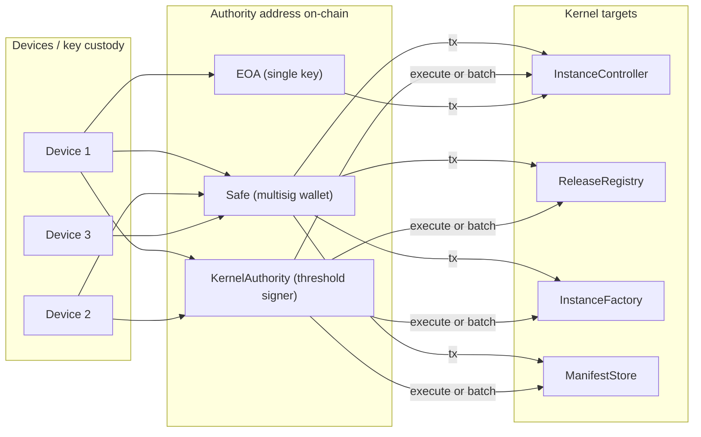
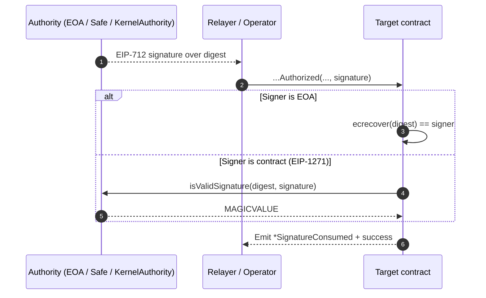
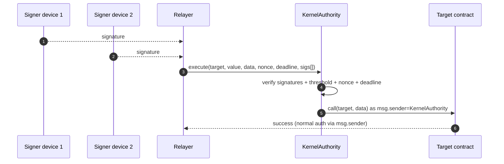

# Authority Modes (Safe vs KernelAuthority vs EOA)

BlackCat separates *what must be authorized* (install/upgrade/emergency) from *how it is authorized* (keys / devices).

In v1, `InstanceController` only checks:
- `msg.sender == rootAuthority` (activate upgrades, rotate authorities, security toggles)
- `msg.sender == upgradeAuthority` (propose upgrades)
- `msg.sender == emergencyAuthority` (pause/unpause; root can also pause/unpause as a fallback)

This means **multi-device security is achieved by choosing authority addresses appropriately**.

## Visual overview (call paths)

Rendered diagram (SVG):

Diagram source: `docs/diagrams/authority-modes.excalidraw`

Mermaid source (diff-friendly)

## Visual overview (relayed signatures)

Some operations also support **relayers**: a device signs an EIP-712 message and a relayer submits the transaction.

## Overview

You can choose one of these modes for each authority:

### Mode A — Safe (recommended)

Set `rootAuthority` / `upgradeAuthority` / `emergencyAuthority` to a Safe multisig address.

Properties:
- Strong real-world security and operational UX (devices sign in Safe, Safe submits a single tx).
- Widely reviewed and battle-tested.
- Upgrades and governance are “by design” multi-device without custom code in the kernel.

Trade-offs:
- Depends on Safe tooling/flow (UI, policies, etc.).

### Mode B — `KernelAuthority` (multi-device by design, no Safe dependency)

Use `blackcat-kernel-contracts/src/KernelAuthority.sol` as a **minimal EIP-712 threshold signer** contract.

Flow:
1. Deploy `KernelAuthority(signers[], threshold)` (signers must be strictly sorted by address).
2. Set an `InstanceController` authority address to the deployed `KernelAuthority`.
3. For every action:
   - multiple devices sign an EIP-712 “Execute” message,
   - one submitter calls `KernelAuthority.execute(...)`,
   - `KernelAuthority` verifies signatures + nonce + deadline,
   - then `KernelAuthority` calls the target contract (e.g., `InstanceController`).

Additionally, `KernelAuthority` implements **EIP-1271** (`isValidSignature`) so it can be used as a signature-validating authority
for bootstrap flows (e.g. factory setup authorization) without needing to execute the action itself.

For operational convenience, `KernelAuthority` also supports `executeBatch(...)` (single threshold approval for multiple calls).

### Diagram: `KernelAuthority.execute(...)` call flow

Properties:
- Multi-device is enforced by the contract itself.
- No Safe dependency.
- Nonce + EIP-712 domain binding prevents replay on other chains/contracts.
- Config changes (`setConfig`) are only possible via a threshold-signed `execute` (the contract is self-governed).

Trade-offs / warnings:
- This is custom security code and must be audited before production use.
- Requires CLI/installer tooling to collect and order signatures.
- Signatures must be supplied **sorted by signer address** (strictly increasing).
  - Each signer signature may be 65-byte `(r,s,v)` or 64-byte EIP-2098 compact `(r,vs)`.
  - The contract enforces “low-s” (`s <= secp256k1n/2`) to prevent malleability.

### Mode C — EOA (dev only)

Set an authority to a normal wallet address (one key).

Properties:
- Simplest for local development / test networks.

Warnings:
- Not multi-device.
- Not suitable for production unless you accept single-key compromise risk.

## Recommended defaults (production)

- `rootAuthority`: Mode A (Safe) with the highest threshold.
- `upgradeAuthority`: Mode A or B depending on your ops model.
- `emergencyAuthority`: Mode A/B with separate devices stored offline.

Additionally:
- Enable controller timelock (`minUpgradeDelaySec`) so proposals can be reviewed before activation.
- Enable `autoPauseOnBadCheckIn` if you have a reliable reporter agent.

## What must never happen

- Production runs with Mode C (EOA) for `rootAuthority` without an explicit risk acceptance.
- A relayer is treated as an authority (relayers are *submitters*, not *signers*).
- Authority addresses can be modified from untrusted runtime config without on-chain attestation/locking.

## What auditors should look at

1. Which authority mode is used for each role (A/B/C).
2. Thresholds + signer custody model (devices, rotation policy, recovery).
3. Whether `minUpgradeDelaySec` is non-zero (timelock).
4. Whether `releaseRegistry` is configured and used for root trust enforcement.
5. Whether `autoPauseOnBadCheckIn` is enabled and how reporter integrity is ensured.
